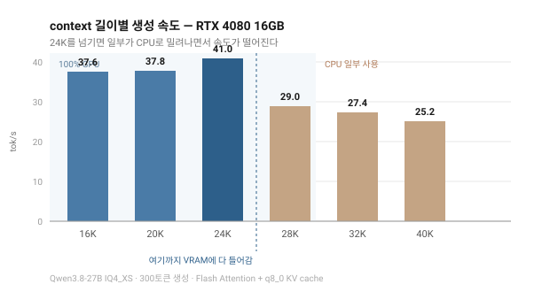
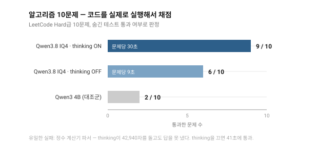
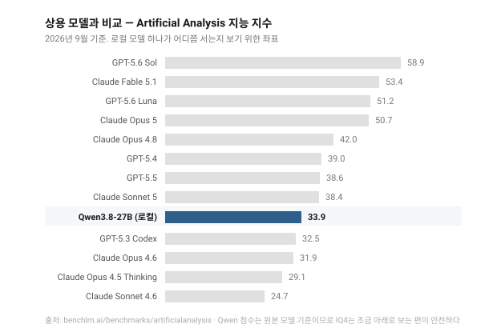
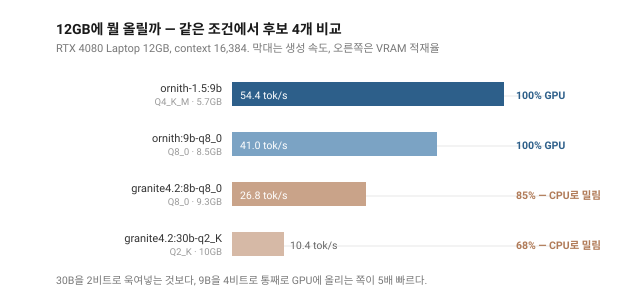
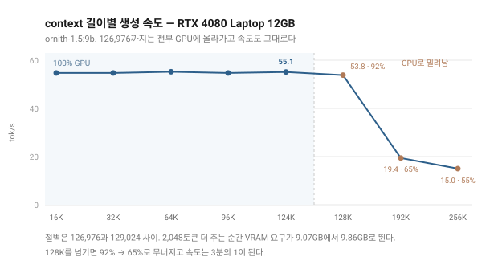
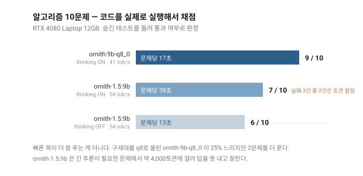

# Ollama Local Setting

그래픽카드별로 "이 카드에서는 이 모델을 이 설정으로 돌리면 된다"를 모으는 저장소다.

로컬 LLM을 깔아보면 늘 이 지점에서 막히지 않나. 모델 페이지는 "16GB VRAM 권장"이라고만 적어두고, 정작 내 카드에서 몇 토큰짜리 context까지 GPU에 올라가는지, 거기서 속도가 얼마나 나오는지, 그 속도로 실제 코딩을 시켜보면 쓸 만한지는 직접 재보기 전에는 알 수 없다. 그래서 직접 재봤다. 재는 스크립트와 결과를 같이 올려둔 게 이 저장소.

**같은 카드를 쓴다면** 설치 스크립트 하나로 똑같은 환경이 만들어진다. 명령 세 줄이면 끝. **다른 카드를 쓴다면** 벤치마크를 돌려 자기 카드의 값을 찾고, 그 결과를 여기에 보내주면 된다. 카드별 설정표를 채우는 게 목표다.

## 지금까지 모인 결과

| GPU | VRAM | 모델 | 최대 context (100% GPU) | 생성 속도 | 코딩 10문제 |
|---|---|---|---|---|---|
| [RTX 4080](results/rtx4080-16gb.md) | 16GB | Qwen3.8-27B IQ4_XS | 24,576 | 41.0 tok/s | 9 / 10 |
| [RTX 4080 Laptop](results/rtx4080-laptop-12gb.md) | 12GB | ornith-1.5:9b | 126,976 | 54.6 tok/s | 7 / 10 |
| [RTX 4080 Laptop](results/rtx4080-laptop-12gb.md) | 12GB | ornith:9b-q8_0 | 53,248 | 41.0 tok/s | 9 / 10 |

같은 "RTX 4080"이라도 노트북용은 다른 카드다. VRAM이 16GB가 아니라 12GB고, 그 차이가
올릴 수 있는 모델을 바꾼다. 12GB 쪽에 두 줄이 있는 건 하나로 정할 수 없어서다.
빠르고 context가 긴 쪽과 정답률이 높은 쪽이 갈렸다.

여기 자기 카드를 추가하려면 [CONTRIBUTING.md](CONTRIBUTING.md)를 보면 된다.

## 설치

Windows / PowerShell 7 기준이다. Ollama와 curl만 있으면 된다.

```powershell
git clone https://github.com/Chang-Jin-Lee/Ollama-Local-Setting.git
cd Ollama-Local-Setting
```

그 다음은 카드에 따라 갈린다.

### VRAM 16GB 이상

```powershell
pwsh -File setup/install.ps1
```

환경변수를 잡고, GGUF 14GB를 받고, Ollama에 등록하고, OpenCode와 Superpowers까지 깐다. 끝나면 Ollama를 완전히 껐다 켜야 환경변수가 먹는다.

모델만 원하면 `-SkipAgent`, context를 직접 정하려면 `-Ctx 16384`을 붙이면 된다.

### VRAM 12GB

14GB짜리 모델은 안 들어간다. 9B을 쓰고 대신 context를 길게 가져간다.

```powershell
[Environment]::SetEnvironmentVariable('OLLAMA_FLASH_ATTENTION','1','User')
[Environment]::SetEnvironmentVariable('OLLAMA_KV_CACHE_TYPE','q8_0','User')
[Environment]::SetEnvironmentVariable('OLLAMA_CONTEXT_LENGTH','126976','User')

pwsh -File setup/pull-curl.ps1 -Model ornith-1.5:9b
```

`ollama pull`을 안 쓰는 이유는 아래 "설치 중에 걸렸던 것들"에 적었다. 환경변수를 넣었으면
Ollama를 완전히 껐다 켜야 한다. `llama-server.exe`까지 같이 죽여야 하는 것도 아래에 적었다.

확인:

```powershell
pwsh -File bench/speed.ps1 -Model ornith-1.5:9b
```

## RTX 4080 16GB에서 나온 수치

### context를 어디까지 올릴 수 있나



VRAM 16GB에 13.3GiB짜리 모델을 올리면 남는 자리가 빠듯하다. 24K까지는 모델도 KV cache도 전부 VRAM에 들어가 41 tok/s가 나온다. 28K부터는 일부가 CPU로 밀려나면서 29 tok/s로 떨어진다. 그 사이가 절벽.

재미있는 건 VRAM을 비워도 소용없다는 점이다. 브라우저와 다른 프로그램을 다 꺼서 6GB를 더 확보한 뒤 32K를 재시도해도 결과는 93% GPU로 똑같았다. Ollama가 계산 버퍼 자리를 따로 떼어놓기 때문.

그러니 "VRAM이 남으니까 context를 더 주자"는 통하지 않는다. 카드마다 직접 훑어서 절벽 위치를 찾아야 한다. `bench/ctx-sweep.ps1`이 그걸 해준다.

### 실제로 코드를 짜게 시켜보면



문제는 LeetCode Hard급 10개. 채점 방식은 이렇다. 모델이 내놓은 코드를 파일로 저장하고 숨겨둔 테스트와 함께 실제로 실행한다. 사람이나 다른 모델이 답을 읽고 판단하는 방식이 아니라는 뜻.

thinking을 켜면 10문제 중 9개를 통과한다. O(log(min(m,n))) 중앙값 문제는 랜덤 200케이스 교차검증을 통과했고, 스레드 안전 RateLimiter는 5스레드가 100회씩 동시에 때려도 정확히 50개만 허용했다. 대신 문제당 30초.

thinking을 끄면 9초로 줄지만 6개밖에 못 푼다. 품질 차이가 50%. 실제 작업에서는 켜두는 쪽이 맞다.

실패한 건 딱 하나. 단항 마이너스가 들어간 정수 계산기 파서였는데, thinking이 끝나질 않았다. 토큰 한도를 12,000으로 올려줬더니 42,940자를 생각하고도 답을 못 냈다. `--5` 같은 엣지 케이스에서 결론을 못 내고 자기 검증만 반복한 셈. 그런데 thinking을 끄니 41초 만에 통과. 에이전트로 돌리다 이게 터지면 한참 멈춘 것처럼 보이니, 그럴 땐 끊고 문제를 더 잘게 쪼개는 편이 낫다.

### 상용 모델과 비교하면



14GB짜리 파일 하나가 GPT-5.3 Codex와 Claude Opus 4.6 사이에 선다. GPT-5.4나 Opus 4.8에는 못 미치지만 Sonnet 4.6보다는 위.

다만 이건 단발 문제 기준. 여러 파일을 고치며 몇 시간씩 돌아가는 에이전트 작업은 DeepSWE 42.2점으로, Opus 4.8(59)이나 GPT-5.6 Sol(73)과 격차가 크다. 함수 하나 구현, 버그 하나 추적, 코드 리뷰처럼 잘게 쪼갠 일에 쓸 것.

양자화 손실은 걱정할 것 없다. 같은 모델을 양자화별로 비교한 [측정](https://quesma.com/blog/qwen38-27b-quantizations-benchmarked/)에서 4비트는 GPQA Diamond 85%로 BF16의 86%와 거의 같았고, Terminal-Bench는 75%로 동일했다. 무너지는 건 2비트 아래.

## RTX 4080 Laptop 12GB에서 나온 수치

같은 이름이지만 다른 카드다. 전문은 [results/rtx4080-laptop-12gb.md](results/rtx4080-laptop-12gb.md)에 있다.

### 잰 머신

| | |
|---|---|
| GPU | NVIDIA GeForce RTX 4080 Laptop GPU (Ada AD104) — 12,282 MiB, 드라이버 610.74, CUDA 13.3, compute 8.9 |
| CPU | Intel Core i9-14900HX — 24C / 32T |
| RAM | DDR5-5600 32GB (Samsung 16GB x 2) |
| 저장장치 | WD PC SN8000S 1TB NVMe |
| 본체 / OS | Lenovo 83DE / Windows 11 Home 10.0.26200 |
| Ollama | 0.33.3 |
| 측정일 | 2026-09-16 |

최종 설정은 이 세 줄이다.

```
OLLAMA_FLASH_ATTENTION = 1
OLLAMA_KV_CACHE_TYPE   = q8_0
OLLAMA_CONTEXT_LENGTH  = 126976
```

### 한눈에

속도는 두 모델을 같은 조건(context 16,384)에서 잰 값이다. 권장 설정에서 다시 잰 값은
아래 [속도](#속도)에 있다.

| 항목 | ornith-1.5:9b | ornith:9b-q8_0 |
|---|---|---|
| 파일 크기 | 6.6GB (Q4_K_M) | 9.5GB (Q8_0) |
| 100% GPU 최대 context | **126,976** | 53,248 |
| 생성 속도 | **54.4 tok/s** | 41.0 tok/s |
| 프롬프트 처리 | **2,790 tok/s** | 2,653 tok/s |
| 모델 로딩 | 3.5초 | 6.2초 |
| 코딩 10문제 | 7 / 10 | **9 / 10** |
| 이미지 입력 | 가능 | 불가 |

### 뭘 올릴 수 있나



후보 넷을 같은 조건(context 16,384)에서 돌렸다.

| 모델 | 파일 | 실제 점유 | GPU 적재 | 생성 | 프롬프트 처리 | 로딩 |
|---|---|---|---|---|---|---|
| **ornith-1.5:9b** | 6.6GB | 5.69GB | **100%** | **54.4 tok/s** | 2,790 tok/s | 3.5초 |
| ornith:9b-q8_0 | 9.5GB | 8.51GB | 100% | 41.0 tok/s | 2,653 tok/s | 6.2초 |
| granite4.2:8b-q8_0 | 9.3GB | 11.42GB | 85% | 26.8 tok/s | 2,055 tok/s | 6.5초 |
| granite4.2:30b-q2_K | 10GB | 14.38GB | 68% | 10.4 tok/s | 541 tok/s | 8.3초 |

여기서 배운 게 하나 있다. **파일 크기를 VRAM에 맞추면 안 된다.**
granite4.2:8b는 파일이 9.3GB로 12GB 안에 들어가는데, 올려보면 11.42GB를 요구해 15%가 CPU로
밀려난다. 가중치만 올라가는 게 아니라 KV cache와 계산 버퍼가 같이 올라가기 때문이다.

30B을 2비트로 욱여넣는 쪽은 더 나쁘다. 68%만 GPU에 올라가 10.4 tok/s. 같은 카드에서 9B을
4비트로 통째로 올리면 54.4 tok/s다. 5배 차이다.

### context는 오히려 16GB보다 길다



| context | 요구량 | GPU 적재 | 생성 속도 |
|---|---|---|---|
| 16,384 | 5.69GB | 100% | 54.7 tok/s |
| 65,536 | 7.14GB | 100% | 55.2 tok/s |
| 98,304 | 8.17GB | 100% | 54.7 tok/s |
| 122,880 | 8.94GB | 100% | 54.9 tok/s |
| **126,976** | **9.07GB** | **100%** | **55.1 tok/s** |
| 129,024 | 9.86GB | 91% | 53.9 tok/s |
| 131,072 | 9.92GB | 92% | 53.8 tok/s |
| 196,608 | 12.77GB | 65% | 19.4 tok/s |
| 262,144 | 15.15GB | 55% | 15.0 tok/s |

126,976까지 전부 GPU에 올라간다. 16GB 데스크톱이 24,576이었으니 5.2배다. 카드는 더 작은데
context는 더 길다. 모델이 14GB에서 5.7GB로 줄어 남은 자리가 전부 KV cache로 갔기 때문.

절벽은 126,976과 129,024 사이다. 2,048토큰을 더 주는 순간 요구량이 9.07GB에서 9.86GB로
0.79GB나 뛴다. 조금씩 늘다가 넘치는 게 아니라 계단이라, 훑어서 위치를 찾는 수밖에 없다.

context를 16K에서 127K로 8배 늘려도 생성 속도는 54.7에서 55.1로 그대로다. 전부 GPU에
올라가 있는 한 context 길이는 속도에 영향을 주지 않는다.

### 속도

권장 설정(context 126,976)에서 `ornith-1.5:9b`을 3회 측정했다.

| 항목 | 값 |
|---|---|
| 생성 속도 | 54.6 tok/s (54.7 / 54.6 / 54.5) |
| 프롬프트 처리 | 2,511 tok/s (2,450 / 2,536 / 2,547) |
| 500토큰 생성 | 9.4초 |
| 모델 로딩 | 3.5초 |
| VRAM 점유 | 9.07 / 12.0GB — 100% GPU |

16GB 데스크톱(41.0 tok/s, 500토큰 12.2초)보다 33% 빠르다. 27B 대신 9B을 돌리니 당연한
결과지만, 그 대가로 코딩 정답률이 9/10에서 7/10으로 내려갔다.

### 코드를 짜게 시켜보면



| 모델 / 설정 | 통과 | 문제당 | 생성 속도 | 비고 |
|---|---|---|---|---|
| ornith:9b-q8_0 · thinking ON | **9 / 10** | 17초 | 40.9 tok/s | |
| ornith-1.5:9b · thinking ON | 7 / 10 | 39초 | 56.1 tok/s | 실패 3건 중 2건은 토큰 잘림 |
| ornith-1.5:9b · thinking OFF | 6 / 10 | 13초 | 48.6 tok/s | 1건은 생성 중단으로 채점 불가 |

빠른 쪽이 더 잘 푸는 게 아니었다. 구세대를 q8로 올린 `ornith:9b-q8_0`이 25% 느리고 context도
절반 이하인데 2문제를 더 푼다. 답도 짧다. `ornith-1.5:9b`이 4,000토큰을 쓰고도 못 끝낸 문제를
803토큰으로 끝냈다.

`ornith-1.5:9b`의 실패 3건 중 2건은 실력이 아니라 한도 문제다. 이 모델은 `num_predict`를
아무리 올려도 약 4,000토큰에서 잘린다. 같은 서버에서 granite4.2는 8,192를 정확히 지키니
Ollama 문제가 아니고, thinking을 꺼도 똑같이 잘리니 thinking 문제도 아니다. 원인은 못 찾았다.

16GB 쪽에서 Qwen3.8-27B이 유일하게 실패했던 정수 계산기 파서는 여기서는 통과했다.

### 이미지도 된다

16GB 쪽에서 VRAM이 모자라 뺐던 항목인데 여기서는 된다. `ornith-1.5:9b`에 CLIP 프로젝터가
같이 들어 있어 따로 받을 게 없다. 막대 3개짜리 차트를 넣고 제목과 값을 물었더니 전부
정확히 읽었다. 이미지는 181토큰으로 들어갔다.

| context | 점유 | GPU 적재 | 속도 | 값 정확도 |
|---|---|---|---|---|
| 126,976 | 9.07GB | 100% | 55.3 tok/s | 정확 |
| 65,536 | 7.14GB | 100% | 55.3 tok/s | 정확 |

권장 설정 그대로 두고 이미지를 넣어도 100% GPU가 유지된다. context를 낮출 필요가 없었다.

### 그래서 뭘 쓸까

| 하려는 일 | 고를 것 |
|---|---|
| 긴 파일·저장소를 통째로 넣기 | `ornith-1.5:9b` — 127K가 전부 GPU에 |
| 이미지가 필요할 때 | `ornith-1.5:9b` — 비전 포함, 추가 VRAM 없음 |
| 정답률이 중요한 코딩 | `ornith:9b-q8_0` — 9/10 대 7/10 |
| 대화형 응답 속도 | `ornith-1.5:9b` — 54.6 대 41.0 tok/s |

둘 다 받아두고 쓰임에 따라 바꾸는 게 낫다. 합쳐서 16GB고, 디스크는 남는다.

## 설치 중에 걸렸던 것들

문서대로 했는데 안 되는 지점이 몇 군데 있었다. 스크립트에는 이미 반영해둔 것들.

**`ollama pull hf.co/...`가 0%에서 멈춘다.** 허깅페이스에서 직접 받는 기능인데 파일을 미리 할당해놓고 그대로 멈춰 있었다. 진행률이 13GB로 보이는 게 함정. 그건 빈 파일 크기였다. `curl -L -C -`로 받아서 `ollama create`로 등록하는 편이 확실하다.

**npm이 OpenCode의 postinstall을 막는다.** `npm install -g opencode-ai`만 하면 `opencode --version`은 뜨는데 네이티브 바이너리가 안 깔린다. `--allow-scripts=opencode-ai`가 필요.

**Superpowers를 `--prefix` 없이 설치하면 엉뚱한 곳으로 간다.** 홈 디렉터리에 `package.json`이 있으면 npm이 거기까지 거슬러 올라가 설치해버리기 때문.

**OpenCode는 로컬 Ollama를 자동으로 찾지 못한다.** 설치 직후 `opencode models`에 Ollama 모델이 하나도 안 나왔다. `setup/opencode.json`처럼 provider를 직접 써줘야 잡히더라.

**`ollama pull`이 진행률 중간에 멈춘다.** 12GB 쪽에서 겪었다. 5.4GB에서 멈춘 뒤 한 바이트도
안 늘었고, `server.log`에는 `part N stalled; retrying`만 쌓였다. Ollama는 블롭 하나를 16개
파트로 병렬로 받는데 그게 전부 stall에 빠진 것. 회선 문제는 아니었다. 같은 순간 같은 URL을
curl 단일 연결로 받으면 18.9 MB/s가 나왔다. 파트 수를 줄이는 환경변수는 없다
(`OLLAMA_MAX_TRANSFER_STREAMS`는 safetensors 전용). `setup/pull-curl.ps1`이 매니페스트를 직접
읽어 curl로 받아 넣는다. 같은 회선에서 21.7 MB/s로 끝까지 받았다.

**Ollama를 강제 종료하면 VRAM이 안 돌아온다.** `ollama`와 `ollama app`을 죽여도 자식인
`llama-server.exe`가 남아 10.4GB를 쥐고 있었다. `ollama ps`에는 아무것도 안 올라온 걸로 나온다.
환경변수 바꾸고 재시작할 때 같이 죽여야 한다.

**받는 중에는 파일 크기를 믿으면 안 된다.** Windows가 열려 있는 핸들에 대해 디렉터리 항목의
크기를 갱신하지 않아 `Get-ChildItem`에는 계속 0바이트로 나온다. 멈춘 줄 알고 6분을 헤맸는데
그동안 8.47GB가 쓰이고 있었다. 핸들을 열어서 `$fs.Length`를 봐야 진짜 크기가 나온다.

**프롬프트 처리 속도는 같은 프롬프트로 반복해서 재면 안 된다.** 2회차부터 캐시가 걸려
33토큰 중 29토큰이 cached로 잡힌다. 그 상태로 계산하면 691 tok/s가 나오는데 제대로 재면
2,790 tok/s다. 고유 문자열을 맨 앞에 붙이는 것으로도 부족했다. Ollama 0.33.3의 캐시는
접두사가 달라도 재사용한다. `bench/prompt-gen.ps1`이 모든 줄에 고유값을 섞어 만든다.

**공식 `qwen3.8:27b` 태그(18GB)는 16GB 카드에서 쓰면 안 된다.** 가중치만으로 VRAM을 넘겨 CPU로 밀려난다. 결과는 체감될 만큼 느린 속도. 같은 모델의 IQ4_XS(14GB)는 통째로 GPU에 올라가 훨씬 빠르게 돈다. 27B를 16GB에 억지로 욱여넣느니 양자화를 한 단계 내려 전부 GPU에 올리는 편이 낫다.

## 코딩 에이전트로 쓰기

`setup/install.ps1`(16GB 경로)이 [OpenCode](https://opencode.ai)와 [Superpowers](https://github.com/obra/superpowers)까지 깔아준다. 12GB 경로로 설치했다면 이건 따로 깔아야 한다. Superpowers는 브레인스토밍, 계획 수립, TDD, 디버깅, 코드 리뷰 워크플로를 스킬로 붙여주는 프레임워크다.

```powershell
cd <프로젝트 폴더>
opencode
```

RTX 4080 16GB에서 확인한 것: 스킬 14개 로드, 파일 쓰기와 셸 실행 동작, "TDD로 divide 함수를 추가해라"고 하자 테스트를 먼저 쓰고 실행해서 ImportError로 RED를 확인한 뒤 구현하고 GREEN을 확인하는 사이클이 지시 없이 돌았다. 작업 중에도 100% GPU를 유지했다. 12GB 쪽에서는 이 항목을 안 돌려봤다.

## 이 저장소에 있는 것

```
setup/
  install.ps1                 한 번에 설치 (16GB 이상)
  pull-curl.ps1               ollama pull 이 stall 될 때 쓰는 우회 다운로더
  Modelfile.qwen3.8-iq4       렌더러·파서·샘플링 값이 들어간 Ollama Modelfile
  opencode.json               OpenCode에서 로컬 Ollama를 쓰는 설정
bench/
  model-pick.ps1              후보 모델들을 같은 조건으로 비교해 뭘 올릴지 고르기
  ctx-sweep.ps1               context를 훑어 100% GPU 한계선 찾기
  speed.ps1                   생성 속도, 프롬프트 처리 속도, 로딩 시간
  prompt-gen.ps1              캐시에 안 걸리는 긴 프롬프트 생성 (위 두 개가 같이 씀)
  run.py, tasks.py            알고리즘 10문제를 실행 채점
results/
  rtx4080-16gb.md             측정 기록 전문
  rtx4080-laptop-12gb.md      측정 기록 전문
  model-pick-12gb.json        모델 비교 원본 수치
  ctx-sweep-12gb.json         context 스윕 원본 수치
  rtx4080-laptop-12gb-coding.json   코딩 벤치마크 원본 수치
```

## 참고한 곳

- [Unsloth Qwen3.8-27B GGUF](https://huggingface.co/unsloth/Qwen3.8-27B-GGUF) — 양자화별 파일
- [ornith-1.5](https://ollama.com/library/ornith-1.5) · [ornith](https://ollama.com/library/ornith) · [granite4.2](https://ollama.com/library/granite4.2) — 12GB에서 시험한 모델들
- [Qwen3.8-27B 양자화 벤치마크](https://quesma.com/blog/qwen38-27b-quantizations-benchmarked/) — 4비트가 어디까지 버티는지
- [Artificial Analysis 지수](https://benchlm.ai/benchmarks/artificialanalysis) — 상용 모델 점수
- [Superpowers](https://github.com/obra/superpowers) · [OpenCode](https://opencode.ai)

MIT 라이선스다.
