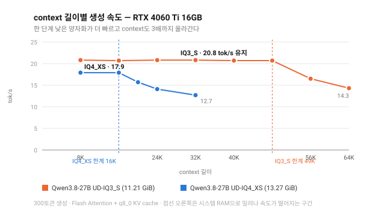
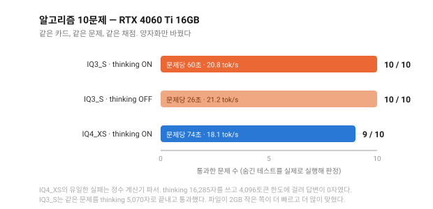

# Ollama Local Setting

그래픽카드별로 "이 카드에서는 이 모델을 이 설정으로 돌리면 된다"를 모으는 저장소다.

로컬 LLM을 깔아보면 늘 이 지점에서 막히지 않나. 모델 페이지는 "16GB VRAM 권장"이라고만 적어두고, 정작 내 카드에서 몇 토큰짜리 context까지 GPU에 올라가는지, 거기서 속도가 얼마나 나오는지, 그 속도로 실제 코딩을 시켜보면 쓸 만한지는 직접 재보기 전에는 알 수 없다. 그래서 직접 재봤다. 재는 스크립트와 결과를 같이 올려둔 게 이 저장소.

**같은 카드를 쓴다면** 설치 스크립트 하나로 똑같은 환경이 만들어진다. 명령 세 줄이면 끝. **다른 카드를 쓴다면** 벤치마크를 돌려 자기 카드의 값을 찾고, 그 결과를 여기에 보내주면 된다. 카드별 설정표를 채우는 게 목표다.

## 지금까지 모인 결과

| GPU | VRAM | 대역폭 | 모델 | 최대 context (100% GPU) | 생성 속도 | 코딩 10문제 |
|---|---|---|---|---|---|---|
| [RTX 4080](results/rtx4080-16gb.md) | 16GB | 716 GB/s | Qwen3.8-27B IQ4_XS | 24,576 | 41.0 tok/s | 9 / 10 |
| [RTX 4060 Ti](results/rtx4060ti-16gb.md) | 16GB | 288 GB/s | Qwen3.8-27B **IQ3_S** | 49,152 | 20.6 tok/s | **10 / 10** |

**VRAM만 보고 고르면 틀린다.** 위 두 카드는 VRAM이 똑같이 16GB인데 답이 다르다. 4080은 IQ4_XS에 24K가 맞지만, 4060 Ti는 한 단계 낮은 IQ3_S가 모든 면에서 이긴다 — 더 빠르고, context는 3배 길고, 코딩 문제도 더 많이 맞혔다. 대역폭이 2.5배 낮고 여유 VRAM이 더 빠듯하기 때문이다.

여기 자기 카드를 추가하려면 [CONTRIBUTING.md](CONTRIBUTING.md)를 보면 된다.

## 설치

Windows / PowerShell 7 기준이다. Ollama와 curl만 있으면 된다.

```powershell
git clone https://github.com/Chang-Jin-Lee/Ollama-Local-Setting.git
cd Ollama-Local-Setting
pwsh -File setup/install.ps1
```

환경변수를 잡고, GGUF 14GB를 받고, Ollama에 등록하고, OpenCode와 Superpowers까지 깐다. 끝나면 Ollama를 완전히 껐다 켜야 환경변수가 먹는다.

모델만 원하면 `-SkipAgent`, context를 직접 정하려면 `-Ctx 16384`을 붙이면 된다.

## RTX 4080 16GB에서 나온 수치

### context를 어디까지 올릴 수 있나


VRAM 16GB에 13.3GiB짜리 모델을 올리면 남는 자리가 빠듯하다. 24K까지는 모델도 KV cache도 전부 VRAM에 들어가 41 tok/s가 나온다. 28K부터는 일부가 CPU로 밀려나면서 29 tok/s로 떨어진다. 그 사이가 절벽.

재미있는 건 VRAM을 비워도 소용없다는 점이다. 브라우저와 다른 프로그램을 다 꺼서 6GB를 더 확보한 뒤 32K를 재시도해도 결과는 93% GPU로 똑같았다. Ollama가 계산 버퍼 자리를 따로 떼어놓기 때문.

그러니 "VRAM이 남으니까 context를 더 주자"는 통하지 않는다. 카드마다 직접 훑어서 절벽 위치를 찾아야 한다. `bench/ctx-sweep.ps1`이 그걸 해준다.

### 실제로 코드를 짜게 시켜보면


문제는 LeetCode Hard급 10개. 채점 방식은 이렇다. 모델이 내놓은 코드를 파일로 저장하고 숨겨둔 테스트와 함께 실제로 실행한다. 사람이나 다른 모델이 답을 읽고 판단하는 방식이 아니라는 뜻.

thinking을 켜면 10문제 중 9개를 통과한다. O(log(min(m,n))) 중앙값 문제는 랜덤 200케이스 교차검증을 통과했고, 스레드 안전 RateLimiter는 5스레드가 100회씩 동시에 때려도 정확히 50개만 허용했다. 대신 문제당 30초.

thinking을 끄면 9초로 줄지만 6개밖에 못 푼다. 품질 차이가 50%. 실제 작업에서는 켜두는 쪽이 맞다.

실패한 건 딱 하나. 단항 마이너스가 들어간 정수 계산기 파서였는데, thinking이 끝나질 않았다. 토큰 한도를 12,000으로 올려줬더니 42,940자를 생각하고도 답을 못 냈다. `--5` 같은 엣지 케이스에서 결론을 못 내고 자기 검증만 반복한 셈. 그런데 thinking을 끄니 41초 만에 통과. 에이전트로 돌리다 이게 터지면 한참 멈춘 것처럼 보이니, 그럴 땐 끊고 문제를 더 잘게 쪼개는 편이 낫다.

### 상용 모델과 비교하면


14GB짜리 파일 하나가 GPT-5.3 Codex와 Claude Opus 4.6 사이에 선다. GPT-5.4나 Opus 4.8에는 못 미치지만 Sonnet 4.6보다는 위.

다만 이건 단발 문제 기준. 여러 파일을 고치며 몇 시간씩 돌아가는 에이전트 작업은 DeepSWE 42.2점으로, Opus 4.8(59)이나 GPT-5.6 Sol(73)과 격차가 크다. 함수 하나 구현, 버그 하나 추적, 코드 리뷰처럼 잘게 쪼갠 일에 쓸 것.

양자화 손실은 걱정할 것 없다. 같은 모델을 양자화별로 비교한 [측정](https://quesma.com/blog/qwen38-27b-quantizations-benchmarked/)에서 4비트는 GPQA Diamond 85%로 BF16의 86%와 거의 같았고, Terminal-Bench는 75%로 동일했다. 무너지는 건 2비트 아래.

## RTX 4060 Ti 16GB에서 나온 수치

i9-13900KF / DDR5-4800 128GB / Windows 11 Pro 26200 / Ollama 0.34.1. 전문은 [`results/rtx4060ti-16gb.md`](results/rtx4060ti-16gb.md).

VRAM은 4080과 똑같은 16GB인데 결론이 정반대로 나왔다. 이 카드에서는 **IQ4_XS를 쓰면 안 된다.**

### 한 단계 낮은 양자화가 전부 이긴다



| | IQ3_S (11.21 GiB) | IQ4_XS (13.27 GiB) |
|---|---|---|
| 100% GPU 최대 context | **49,152** | 16,384 |
| 생성 속도 | **20.6 tok/s** | 17.8 tok/s |
| 프롬프트 처리 (warm) | 251~263 tok/s | 251 tok/s |
| 500토큰 생성 | **24.4초** | 28.2초 |
| 모델 로딩 | 4.3초 | 4.3초 |

파일이 2GB 작은 쪽이 더 빠르고 context는 3배 길다. 이유는 두 가지가 겹쳐서다.

첫째, 여유 VRAM이 빠듯하다. 브라우저를 다 꺼도 여유가 14,937 MiB인데 IQ4_XS 파일이 13,593 MiB다. KV cache와 계산 버퍼를 넣을 자리가 1.3GB밖에 안 남아 16K에서 이미 절벽을 만난다. IQ3_S는 3.4GB가 남아 49K까지 간다.

둘째, 메모리 대역폭이 288GB/s로 4080의 716GB/s보다 2.5배 낮다. 생성 속도는 매 토큰마다 가중치를 전부 읽는 작업이라 대역폭에 그대로 묶인다. 읽을 가중치가 2GB 적은 쪽이 그만큼 빨라진다.

**브라우저를 켜두면 결과가 통째로 뒤집힌다.** Chrome과 Docker를 띄운 상태의 여유는 13,330 MiB였고, 이러면 IQ4_XS는 가중치만으로 이미 여유의 102%다. 이때 속도가 8.18 tok/s까지 떨어졌다. 같은 모델을 제대로 올렸을 때의 절반도 안 된다.

### 실제로 코드를 짜게 시켜보면



| 설정 | 통과 | 문제당 평균 |
|---|---|---|
| **IQ3_S · thinking ON** | **10 / 10** | 60초 |
| **IQ3_S · thinking OFF** | **10 / 10** | 26초 |
| IQ4_XS · thinking ON | 9 / 10 | 74초 |

IQ3_S는 thinking을 켜든 끄든 10문제를 다 풀었다. 4080의 IQ4_XS가 thinking을 끄면 9개에서 6개로 떨어졌던 것과 다르다. 다만 문제가 10개뿐이고 설정당 1회씩만 돌린 결과라, "이 10문제에서는 thinking이 이득이 없었다"까지가 말할 수 있는 범위다.

IQ4_XS가 놓친 하나는 4080에서 실패했던 것과 **같은 문제, 같은 방식**이었다. 정수 계산기 파서에서 thinking이 끝나지 않았다.

| | IQ4_XS | IQ3_S |
|---|---|---|
| thinking 길이 | 16,285자 | 5,070자 |
| 출력 토큰 | 4,096 (한도 소진) | 1,949 |
| 답변 | **0자** | 정상 |

thinking 로그를 열어보면 문법 정의까지는 멀쩡히 가놓고 파서 코드를 thinking 안에서 쓰기 시작해 중간에 잘렸다. 같은 카드, 같은 프롬프트에서 양자화만 바꾸니 통과했으니 하드웨어가 아니라 IQ4_XS에 붙어 있는 성질이다.

### 4080과 나란히 놓으면

| | RTX 4080 | RTX 4060 Ti |
|---|---|---|
| 대역폭 | 716 GB/s | 288 GB/s |
| 쓸 모델 | IQ4_XS | **IQ3_S** |
| 최대 context | 24,576 | **49,152** |
| 생성 속도 | 41.0 tok/s | 20.6 tok/s |
| 프롬프트 처리 | 820~848 tok/s | 251~263 tok/s |
| 코딩 10문제 | 9 / 10 | **10 / 10** |

생성은 절반, 프롬프트 처리는 3분의 1이다. 대역폭 비율(2.5배)과 대체로 맞는다. 코딩 점수가 더 높은 건 카드가 좋아서가 아니라 이 카드에 맞는 양자화를 골랐기 때문이다.

## `ollama ps`의 "100% GPU"를 믿으면 안 된다 (Windows)

이건 카드와 상관없이 Windows를 쓰면 다 해당된다. RTX 4060 Ti에서 잡아낸 것.

`ollama ps`가 `PROCESSOR = 100% GPU`라고 찍는데도 속도가 예상의 절반도 안 나오는 경우가 있다. Ollama는 **자기가 의도한 레이어 배치**를 말할 뿐이고, 그 뒤에 드라이버가 무슨 짓을 했는지는 모르기 때문이다. VRAM이 모자라면 WDDM이 초과분을 조용히 시스템 RAM으로 페이징하는데, Ollama 출력에는 아무 흔적도 안 남는다. 속도만 무너진다.

4060 Ti에서 IQ4_XS를 올렸을 때 실제로 이랬다.

| | |
|---|---|
| `ollama ps` | 100% GPU |
| 러너(`llama-server`) 전용 VRAM | 12,897 MB |
| 러너 **공유 메모리(시스템 RAM)** | **1,398 MB** |
| 생성 속도 | 8.18 tok/s (제대로 올리면 20.6) |

진짜로 다 올라갔는지 보려면 이걸 봐야 한다.

```powershell
(Get-Counter '\GPU Process Memory(*)\Shared Usage').CounterSamples |
  Where-Object { $_.CookedValue -gt 1MB }
```

단, **0이어야 한다고 판정하면 안 된다.** WDDM은 context를 2048로 줄여도 600~670MB는 항상 공유 메모리에 잡아둔다. 이건 상시 오버헤드다. 판정 기준은 **바닥값 대비 상승분**이어야 한다. `bench/ctx-sweep.ps1`은 이걸 자동으로 잡아서 판정하도록 고쳐뒀다.

## 설치 중에 걸렸던 것들

문서대로 했는데 안 되는 지점이 몇 군데 있었다. 스크립트에는 이미 반영해둔 것들.

**`ollama pull hf.co/...`가 0%에서 멈춘다.** 허깅페이스에서 직접 받는 기능인데 파일을 미리 할당해놓고 그대로 멈춰 있었다. 진행률이 13GB로 보이는 게 함정. 그건 빈 파일 크기였다. `curl -L -C -`로 받아서 `ollama create`로 등록하는 편이 확실하다.

같은 증상이 **공식 레지스트리에서도** 나왔다(4060 Ti, Ollama 0.34.1). 멈춰 있는지 확인하려면 크기 말고 청크를 봐야 한다. `blobs\sha256-...-partial` 옆의 `-partial-0` ~ `-partial-15`가 전부 0바이트면 실제로는 아무것도 안 받고 있는 것이다.

**멈춘 `ollama pull`을 방치하면 다른 다운로드까지 죽는다.** curl로 GGUF를 받는데 65 KB/s가 나와서 회선 문제인 줄 알았다. 아니었다. 멈춘 `ollama pull`이 연결 16개를 물고 놓지 않아 같이 굶고 있었다. 죽이니 바로 11~16 MB/s로 돌아왔다.

```powershell
Get-CimInstance Win32_Process -Filter "Name='ollama.exe'" |
  Where-Object { $_.CommandLine -match 'pull' } |
  ForEach-Object { Stop-Process -Id $_.ProcessId -Force }
```

**기본 게이트웨이가 둘이면 다운로드 속도가 요동친다.** Wi-Fi와 유선이 둘 다 metric 0이면 같은 CDN에서 0.25 MB/s와 2.6 MB/s를 오간다. `curl --interface <로컬IP>`로 한쪽에 고정하면 27 MB/s가 나왔다. 병렬 연결을 늘리는 건 도움이 안 된다(8병렬로 0.38 MB/s). 연결 수가 아니라 경로 문제라서 그렇다.

**npm이 OpenCode의 postinstall을 막는다.** `npm install -g opencode-ai`만 하면 `opencode --version`은 뜨는데 네이티브 바이너리가 안 깔린다. `--allow-scripts=opencode-ai`가 필요.

**Superpowers를 `--prefix` 없이 설치하면 엉뚱한 곳으로 간다.** 홈 디렉터리에 `package.json`이 있으면 npm이 거기까지 거슬러 올라가 설치해버리기 때문.

**OpenCode는 로컬 Ollama를 자동으로 찾지 못한다.** 설치 직후 `opencode models`에 Ollama 모델이 하나도 안 나왔다. `setup/opencode.json`처럼 provider를 직접 써줘야 잡히더라.

**공식 `qwen3.8:27b` 태그(18GB)는 16GB 카드에서 쓰면 안 된다.** 가중치만으로 VRAM을 넘겨 CPU로 밀려난다. 결과는 체감될 만큼 느린 속도. 같은 모델의 IQ4_XS(14GB)는 통째로 GPU에 올라가 훨씬 빠르게 돈다. 27B를 16GB에 억지로 욱여넣느니 양자화를 한 단계 내려 전부 GPU에 올리는 편이 낫다.

## 코딩 에이전트로 쓰기

설치 스크립트가 [OpenCode](https://opencode.ai)와 [Superpowers](https://github.com/obra/superpowers)까지 깔아준다. Superpowers는 브레인스토밍, 계획 수립, TDD, 디버깅, 코드 리뷰 워크플로를 스킬로 붙여주는 프레임워크다.

```powershell
cd <프로젝트 폴더>
opencode
```

RTX 4080에서 확인한 것: 스킬 14개 로드, 파일 쓰기와 셸 실행 동작, "TDD로 divide 함수를 추가해라"고 하자 테스트를 먼저 쓰고 실행해서 ImportError로 RED를 확인한 뒤 구현하고 GREEN을 확인하는 사이클이 지시 없이 돌았다. 작업 중에도 100% GPU를 유지했다.

## 이 저장소에 있는 것

```
setup/
  install.ps1                 한 번에 설치
  Modelfile.qwen3.8-iq4       렌더러·파서·샘플링 값이 들어간 Ollama Modelfile
  opencode.json               OpenCode에서 로컬 Ollama를 쓰는 설정
bench/
  ctx-sweep.ps1               context를 훑어 한계선 찾기 (공유 메모리 유출까지 검사)
  speed.ps1                   생성 속도, 프롬프트 처리 속도, 로딩 시간
  run.py, tasks.py            알고리즘 10문제를 실행 채점
results/
  rtx4080-16gb.md             측정 기록 전문
  rtx4060ti-16gb.md           측정 기록 전문
```

## 참고한 곳

- [Unsloth Qwen3.8-27B GGUF](https://huggingface.co/unsloth/Qwen3.8-27B-GGUF) — 양자화별 파일
- [Qwen3.8-27B 양자화 벤치마크](https://quesma.com/blog/qwen38-27b-quantizations-benchmarked/) — 4비트가 어디까지 버티는지
- [Artificial Analysis 지수](https://benchlm.ai/benchmarks/artificialanalysis) — 상용 모델 점수
- [Superpowers](https://github.com/obra/superpowers) · [OpenCode](https://opencode.ai)

MIT 라이선스다.
